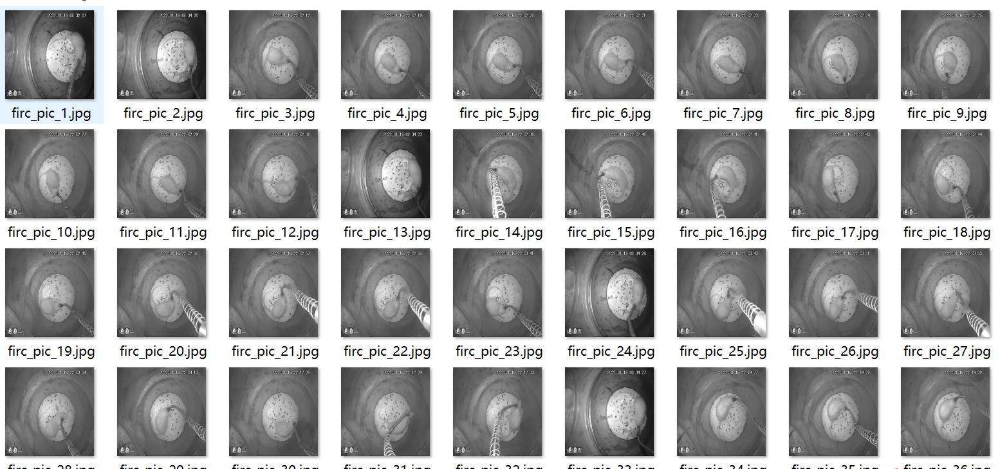
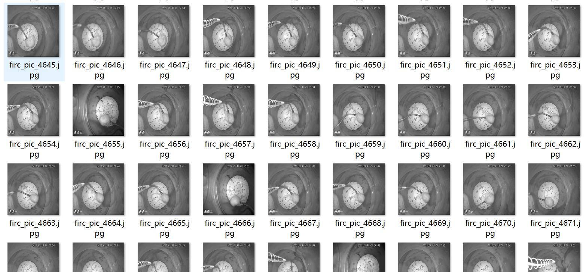
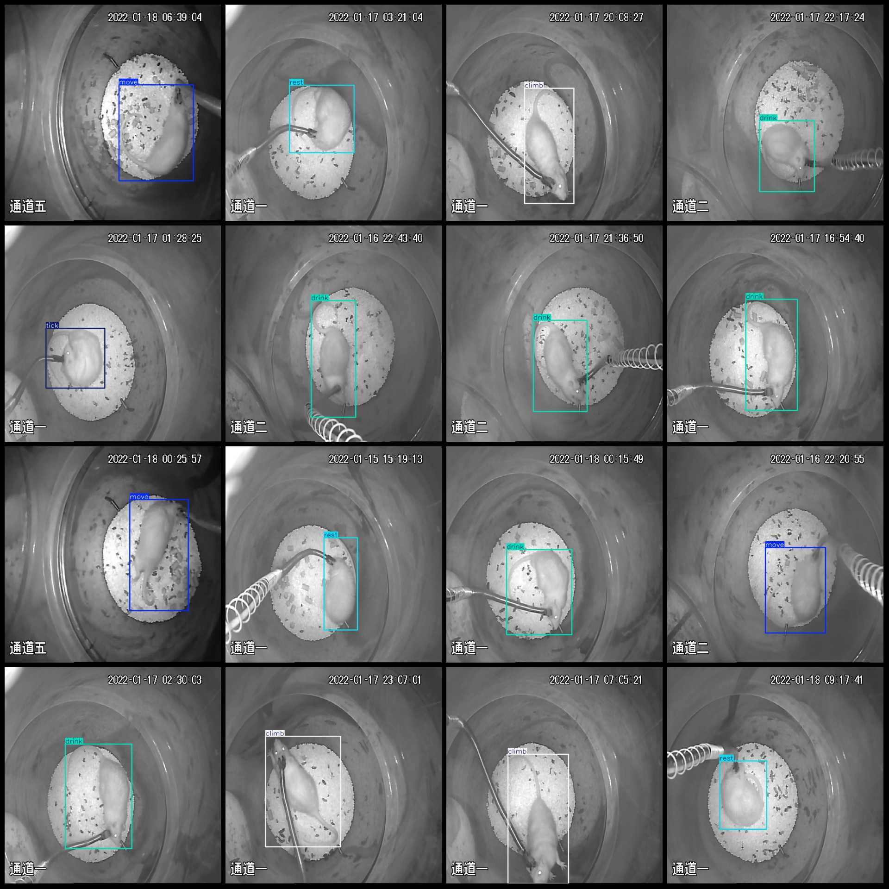
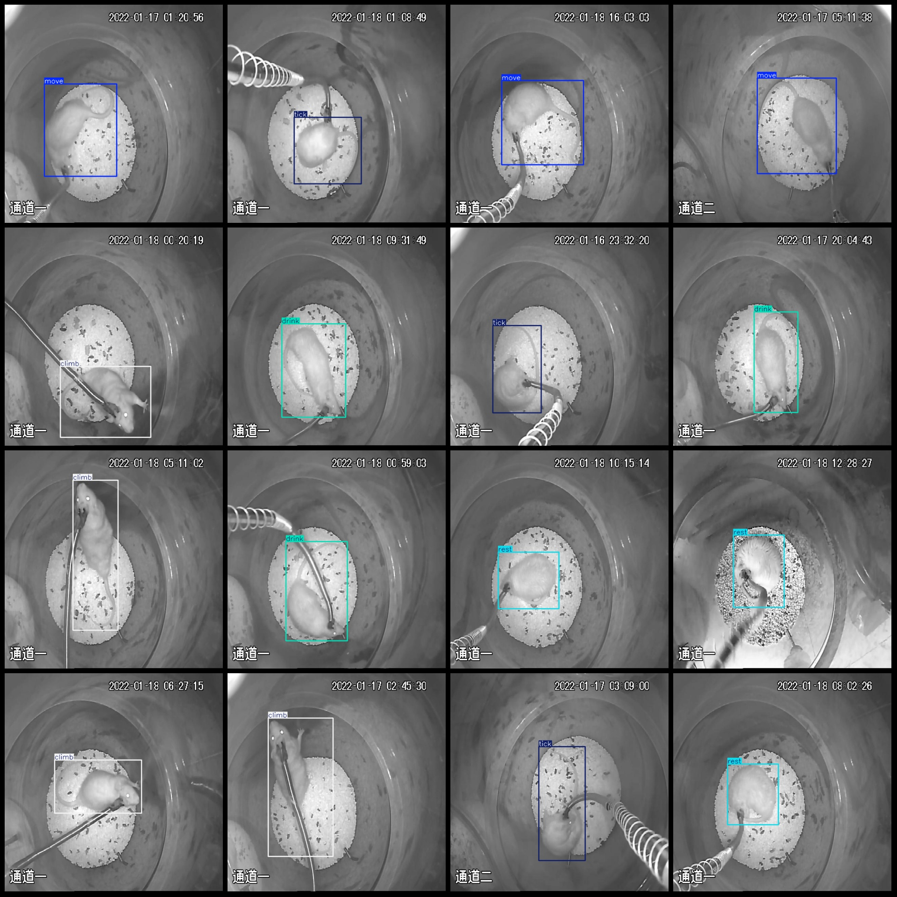

# Behavior Detection in a Monitoring Perspective with 5048 Images in the VOC+YOLO Format

Dataset format: Pascal VOC format + YOLO format (txt file without split path, only contains jpg images and corresponding VOC format xml files and yolo format txt files)
number of images: 5048  
Number of XML files: 5048
annotation count: 5048  
annotationnumber of classes: 5  
Annotation class names: ["climb", "drink", "move", "rest", "tick"]
boxes per class:   
Climbing a box is a physical activity that requires strength and endurance. It can be done in various ways, such as using a rope or harness, climbing up a wall or staircase, or even scaling a cliff or mountain. The number of boxes climbed depends on the individual's fitness level, experience, and the difficulty of the climb itself.
drink_box_count = 992
move_box_count = 1004
rest_box_count = 1012
This is a Python code snippet that uses the `tick()` function to count down from 1005. The `tick()` function in Python is used for timing purposes. Here's the code:

```python
import time

start_time = time.time()
box_count = 1005

for i in range(box_count):
    print(i)
    time.sleep(1)

end_time = time.time()
elapsed_time = end_time - start_time
print("Elapsed time:", elapsed_time, "seconds")
```

In this code, we first import the `time` module to access the `time.time()` function, which returns the current time in seconds since the epoch (January 1, 1970). We then define the `box_count` variable and initialize it to 1005.

Inside the loop, we print the value of `i` and wait for 1 second using `time.sleep(1)`. Finally, we calculate the elapsed time by subtracting the start time from the end time and print it.
total boxes: 5048  
Number of images per category:
It looks like the number 1035 is not a valid image count. Please check if the number is correct and try again.
The number of images labeled as "drink" is 992.
Move = 1004
"Rest (rest) images = 1012" can be translated to: "Images with rest (rest) status = 1012"

```
The number of images owned by rest is 1012.
```
"Tick" (graze) and "possess" are translated to English as "grazing" and "possess", respectively. The number 1005 is translated to English as "1005".
image resolution: 640x640  
Use annotation tool: labelImg
Marking rules: Draw a rectangle around the category.
Important Note: The dataset does not have separate training, validation, and test sets.
Special Statement: This dataset does not guarantee the accuracy of the trained model or weight file.
Preview of the image:
## Images






Here is a pay link on Stripe ( https://buy.stripe.com/3cs8yP7sY87d0vu9AB ). Please contact me lonlonago@foxmail.com after funding $89, and I will send you a complete data files , thank you!

